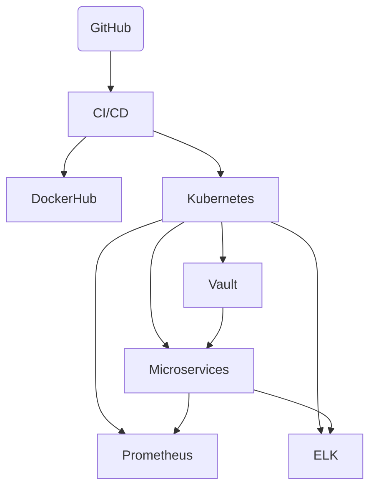

# Enterprise Kubernetes Microservices DevOps Reference

This repository demonstrates a highly scalable, production-grade DevOps pipeline for a polyglot microservices-based enterprise application deployed on Kubernetes. It includes CI/CD automation, infrastructure-as-code, monitoring, logging, secrets management, and resilient deployment strategies.

---

## Features

- **Kubernetes**: Manifests & Helm charts for microservices, autoscaling, and service mesh (Istio or Linkerd).
- **CI/CD**: Automated pipelines using GitHub Actions.
- **Infrastructure-as-Code**: Provision EKS/GKE/AKS clusters and supporting resources with Terraform.
- **Containerization**: Dockerfiles for each service.
- **Monitoring**: Prometheus + Grafana dashboards.
- **Centralized Logging**: ELK Stack (Elasticsearch, Logstash, Kibana) setup.
- **Secrets Management**: HashiCorp Vault integration.
- **Resilient Deployments**: Blue/Green or Canary deployment via Argo Rollouts.
- **Horizontal Scaling**: Kubernetes HPA enabled by custom metrics.

---

## Architecture



---

## Getting Started

### Prerequisites

- [Docker](https://www.docker.com/)
- [kubectl](https://kubernetes.io/docs/tasks/tools/)
- [Terraform](https://www.terraform.io/)
- [Helm](https://helm.sh/)
- [AWS CLI](https://aws.amazon.com/cli/) or [gcloud](https://cloud.google.com/sdk) or [az](https://docs.microsoft.com/en-us/cli/azure/install-azure-cli)
- [Vault CLI](https://developer.hashicorp.com/vault/docs/install)
- [ArgoCD](https://argo-cd.readthedocs.io/en/stable/getting_started/)

---

### Project Structure

```
.
├── .github/workflows/         # GitHub Actions pipelines
├── terraform/                 # Infrastructure-as-Code modules
├── charts/                    # Helm charts for microservices
├── k8s/                       # Raw Kubernetes manifests
├── services/                  # Microservices source code (polyglot)
│   ├── service-a/
│   ├── service-b/
│   └── ...
├── monitoring/                # Prometheus & Grafana configs
├── logging/                   # ELK deployment configs
├── secrets/                   # Vault policies & examples
└── README.md
```

---

## CI/CD Pipeline

- On push/PR:
  - Lint, test, build Docker images
  - Push images to registry
  - Deploy to staging using Helm
  - Run integration tests
  - Manual/auto promotion to production (blue/green)

See `.github/workflows/` for pipeline YAMLs.

---

## Infrastructure Provisioning

```bash
cd terraform/
terraform init
terraform apply
```
Creates cloud K8s cluster, VPC, monitoring/logging resources.

---

## Deployment

1. **Build and Push Images:**
    ```bash
    cd services/service-a
    docker build -t <dockerhub-username>/service-a:latest .
    docker push <dockerhub-username>/service-a:latest
    ```

2. **Deploy via Helm:**
    ```bash
    helm upgrade --install service-a charts/service-a -n production
    ```

3. **Monitor:**
    - Access Grafana: `kubectl port-forward svc/grafana 3000:3000`
    - Access Kibana: `kubectl port-forward svc/kibana 5601:5601`

---

## Secrets Management

- Store secrets in Vault.
- Inject secrets using Kubernetes Vault Injector or CSI driver.

---

## Scaling & Blue/Green

- Edit `values.yaml` for replica count or HPA settings.
- Use Argo Rollouts or Kubernetes native blue/green configuration.

---

## Monitoring & Logging

- Prometheus scrapes and alerts on service metrics.
- Grafana dashboards for visualization.
- ELK stack aggregates logs from all pods.

---

## Security

- RBAC enabled
- NetworkPolicies in place
- Secrets never stored in source code

---

## Contributing

1. Fork the repo
2. Create your feature branch (`git checkout -b feature/foo`)
3. Commit your changes
4. Push to the branch
5. Open a Pull Request

---

## License

MIT

---

## References

- [Kubernetes Official Docs](https://kubernetes.io/docs/)
- [Terraform AWS Provider](https://registry.terraform.io/providers/hashicorp/aws/latest/docs)
- [GitHub Actions](https://docs.github.com/en/actions)
- [HashiCorp Vault](https://www.vaultproject.io/)
- [Argo Rollouts](https://argoproj.github.io/argo-rollouts/)

---


.
├── .github/
│   └── workflows/
│       └── ci-cd.yaml
├── charts/
│   └── service-a/
│       ├── Chart.yaml
│       ├── values.yaml
│       └── templates/
│           ├── deployment.yaml
│           └── service.yaml
├── k8s/
│   ├── service-a.yaml
│   └── service-a-rollout.yaml
├── logging/
│   └── elk.yaml
├── monitoring/
│   ├── prometheus.yaml
│   └── grafana.yaml
├── secrets/
│   └── policy.hcl
├── services/
│   └── service-a/
│       ├── index.js
│       ├── package.json
│       └── Dockerfile
├── terraform/
│   ├── main.tf
│   ├── variables.tf
│   └── outputs.tf
├── .gitignore
└── README.md